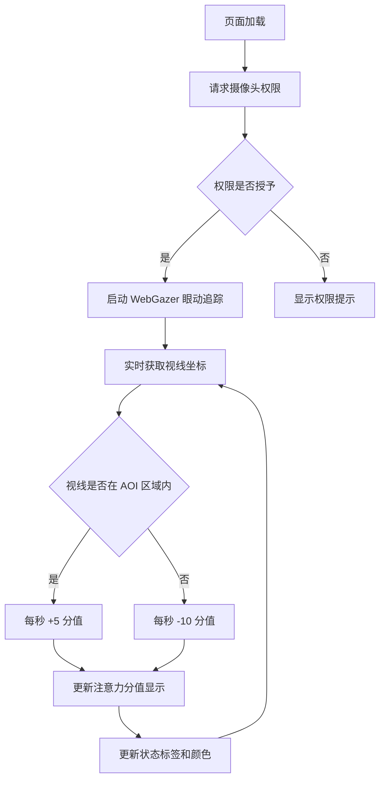

## 1. 产品概述

基于 WebGazer.js 的眼动追踪注意力监测工具，通过摄像头实时追踪用户视线，分析注意力集中程度并给出可视化反馈。面向需要自我监测注意力状态的用户，适用于学习、工作中保持专注的场景。

## 2. 核心功能

### 2.1 用户角色

| 角色 | 注册方式 | 核心权限 |
|------|----------|----------|
| 普通用户 | 无需注册 | 使用全部功能 |

### 2.2 功能模块

1. **主页面**：眼动追踪面板、注意力分值显示、AOI 兴趣区域、控制按钮

### 2.3 页面详情

| 页面名称 | 模块名称 | 功能描述 |
|----------|----------|----------|
| 主页面 | 注意力分值面板 | 顶部显眼位置展示 0-100 的分值，大字体显示，搭配文字状态标签，数值颜色随状态变化 |
| 主页面 | AOI 兴趣区域 | 页面居中 300×300px 区域，浅蓝色半透明边框标记，内部嵌入白色图片 |
| 主页面 | 眼动预测红点 | 实时显示用户视线位置的小红点 |
| 主页面 | 摄像头预览窗口 | 右下角小型摄像头画面预览 |
| 主页面 | 控制按钮组 | 重置分数按钮、暂停/开始追踪按钮 |
| 主页面 | 调试输出 | 浏览器控制台实时输出视线坐标和专注状态 |

## 3. 核心流程

## 4. 用户界面设计

### 4.1 设计风格

- **主色调**：纯白背景，蓝色系强调色
- **分值颜色**：低专注（红色系）→ 高专注（绿色系）渐变
- **字体**：大分值使用醒目有力的无衬线字体，状态标签使用中等粗细字体
- **布局**：居中对称布局，适配桌面端浏览器
- **AOI 区域**：浅蓝色半透明边框 + 内部轻微背景色区分

### 4.2 页面设计概览

| 页面名称 | 模块名称 | UI 元素 |
|----------|----------|---------|
| 主页面 | 注意力分值面板 | 大字号数字（72px+），下方状态标签，分值 0-30 红色「走神」，31-100 绿色「专注」 |
| 主页面 | AOI 兴趣区域 | 300×300px 正方形，浅蓝半透明边框（rgba），白色背景图片居中 |
| 主页面 | 眼动红点 | 8px 红色实心圆点，跟随视线实时移动 |
| 主页面 | 摄像头预览 | 右下角 160×120px 窗口，圆角边框 |
| 主页面 | 控制按钮 | 圆角按钮，蓝色主题，hover 态加深 |

### 4.3 响应式设计

桌面端优先，最小宽度 1024px 适配，固定布局无响应式适配需求。

## 5. 技术约束

- 单个独立 HTML 文件，双击即可在浏览器运行
- 引入 WebGazer.js 官方 CDN（www.webgazer.js.org）
- 纯前端实现，无后端依赖
- 兼容 Chrome/Edge 主流浏览器
- 页面关闭时自动释放摄像头资源