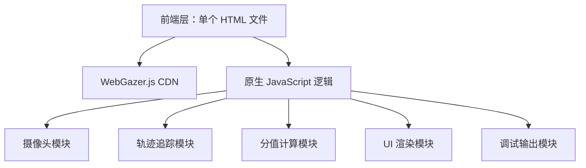

## 1. 架构设计



## 2. 技术描述

- **前端**：纯 HTML5 + CSS3 + 原生 JavaScript（ES6+）
- **眼动追踪**：WebGazer.js v3（官方 CDN 引入）
- **摄像头**：WebRTC getUserMedia API（WebGazer 内部调用）
- **后端**：无
- **数据库**：无
- **外部依赖**：仅 WebGazer.js CDN

## 3. 路由定义

| 路由 | 用途 |
|------|------|
| / | 单一主页面，包含全部功能 |

## 4. 模块划分

### 4.1 页面结构（index.html）

```
根元素 #app
├── #attention-panel          — 注意力分值显示区域
│   ├── #score-value          — 分值数字
│   └── #status-label         — 状态文字
├── #aoi-container             — 兴趣区域容器
│   ├── #aoi-zone              — AOI 兴趣区域（300×300px）
│   │   └── img                — 白色背景图片
│   └── #gaze-dot             — 眼动预测红点
├── #camera-preview            — 摄像头预览窗口
└── #controls                  — 控制按钮组
    ├── #btn-reset             — 重置按钮
    └── #btn-toggle            — 暂停/开始按钮
```

### 4.2 核心逻辑模块

| 模块 | 功能 | 关键实现 |
|------|------|----------|
| 摄像头初始化 | 请求权限、启动追踪 | `webgazer.begin()` |
| 视线坐标监听 | 实时获取 gaze 坐标 | `webgazer.setGazeListener()` |
| AOI 碰撞检测 | 判断视线是否在 AOI 内 | 坐标范围比较 |
| 分值计算 | 按规则增减分值 | `setInterval` 每秒更新 |
| UI 更新 | 渲染分值、状态、红点 | DOM 操作 |
| 资源释放 | 停止追踪、释放摄像头 | `webgazer.end()` + `beforeunload` |

## 5. 数据模型

无持久化数据，所有状态存储在内存中。

核心运行时状态变量：

| 变量 | 类型 | 初始值 | 描述 |
|------|------|--------|------|
| attentionScore | number | 0 | 注意力分值 0-100 |
| isInAOI | boolean | false | 视线是否在 AOI 内 |
| isTracking | boolean | true | 追踪是否进行中 |
| gazeX / gazeY | number | 0 | 当前视线坐标 |

## 6. 关键算法

### 6.1 AOI 区域判定

```
function isGazeInAOI(gazeX, gazeY):
    aoiRect = aoiElement.getBoundingClientRect()
    return gazeX >= aoiRect.left
        && gazeX <= aoiRect.right
        && gazeY >= aoiRect.top
        && gazeY <= aoiRect.bottom
```

### 6.2 分值计算规则

```
每秒执行一次：
if isInAOI:
    score = min(score + 5, 100)
else:
    score = max(score - 10, 0)
```

### 6.3 状态判定

```
if score <= 30: status = "走神", color = 红色
if score >= 31: status = "专注", color = 绿色
```